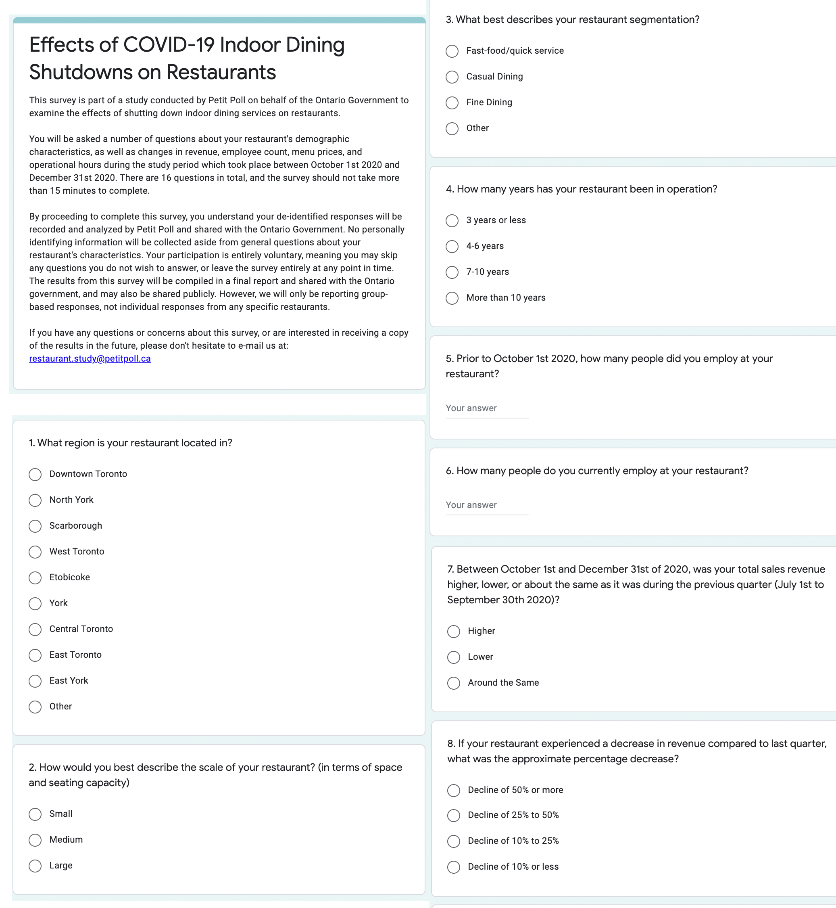
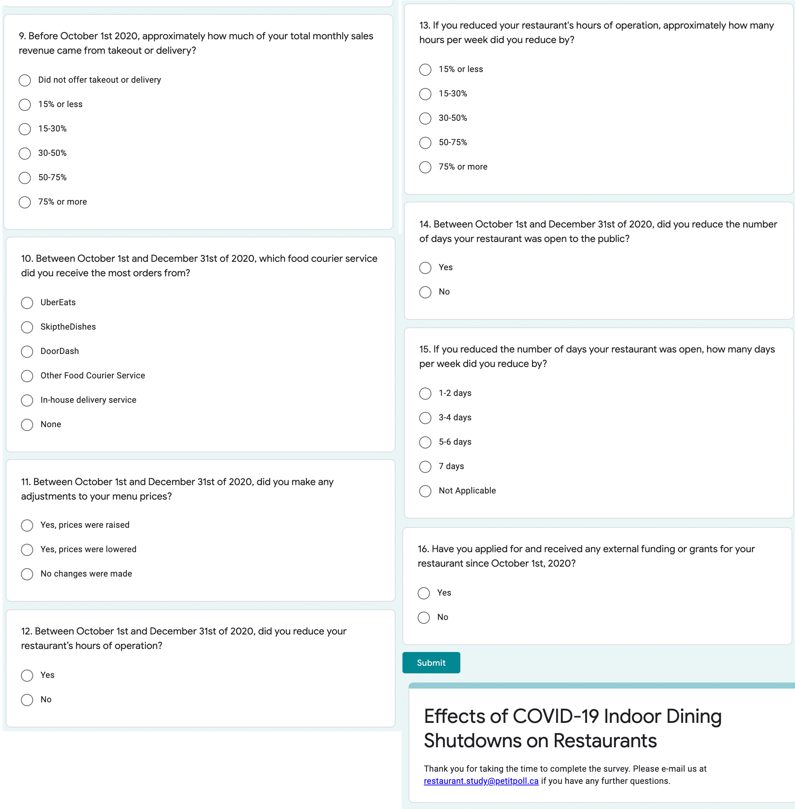

```{r setup, include=FALSE}
knitr::opts_chunk$set(echo = TRUE)
library(bookdown)
library(tidyverse)
library(ggplot2)
library(kableExtra)
library(janitor)
library(dplyr)
library(ggthemes)
library(broom)
library(purrr)
# install.packages('gridExtra')
library(gridExtra)
#devtools::install_github("johannesbjork/LaCroixColoR")
library(LaCroixColoR)
all_simulated_dataset <- 
  readr::read_csv("../../inputs/data/simulated_data.csv")


citation("LaCroixColoR")
```

```{r, echo = FALSE, include=FALSE, message = FALSE}
#### Global Functions ####
### Format percent
percent <- function(x, decimal = 2, format = "f") {   
  paste0(formatC(x, format = format, digits = decimal), "%")
}
### Format table for Chi-squared test
tableChisq <- function(capt, stat, df, p) {  
  chi_stat <- c(stat)
  chi_param <- c(df)
  chi_p <- c(p) %>%
    format(scientific=FALSE)
  
  if (chi_p < 0.05 & chi_p >= 0.01) {
    astr <- "*"
  } else if (chi_p < 0.01 & chi_p >= 0.001) {
    astr <- "**"
  } else if (chi_p < 0.001) {
    astr <- "***"
  } else {
    astr <- ""
  }
    
  chi_df <- data.frame(chi_stat, chi_param, paste(sprintf("%1.3f", as.numeric(chi_p)), astr))
  
  kable(chi_df,
        digits = 3,
        caption = capt,
        booktabs = T,
        col.names = c("X-squared",
                      "df",
                      "p-value")) %>%
    footnote(general = "* p < 0.05, ** p < 0.01, *** p < 0.001",
             general_title = "") %>%
    column_spec(1, bold = T, width = "8em") %>%
    column_spec(2, width = "6em") %>%
    column_spec(3, width = "6em") %>%
    column_spec(4, width = "6em")
}
```
# Introduction

Toronto is a cluster of diverse communities with many different aspects that make it a unique place to live. One of these aspects include restaurant businesses that consist of a wide variety of cuisines all across the city. The Ontario government department has asked us, Petit Poll, to design an experiment to test the implications of COVID-19 shutdowns and its effect on restaurant businesses. During Toronto’s tightest lockdown measures, many restaurants were forced to establish ghost kitchens in which their facilities were designed to focus exclusively on take-out and delivery orders [@kelly2019]. While some restaurants had already been using the ghost kitchen model before the pandemic, the circumstances of the pandemic undoubtedly lead to a rise in this practice [@Doradea2020]. Focusing on take-out and delivery services reduces the costs necessary to run a fully operational brick and mortar restaurant and removes the need for many customer-facing staff members [@kelly2019]. However, there are potential drawbacks that come with this shift as customers are losing the benefits and experiences of indoor dining,  while restaurants are losing an important source of revenue. As pandemic restrictions loosen and restaurants are able to open up their indoor dining services again, it is possible that many restaurants may decide to continue to focus exclusively on take-out and delivery. Given the unprecedented nature of this situation, we do not yet fully understand the extent to which this shift towards take-out and delivery only services will impact restaurants and customer behaviours in the long term. This study aims to measure the effects on restaurant performance which may be associated with shutting down indoor dining, and the changes that restaurants make to deal with this shift. 
 
As data scientists for Petit Poll, we narrowed down our test to restaurants in the city of Toronto as it condenses our test results into one precise area within Ontario. By using a business licensing dataset obtained from the Toronto Open Data Portal [@todp2021], we were able to obtain information on all restaurants in the city. Since eating establishments have been impacted by COVID-19 in the past year, to which there have been irregular restrictions on the businesses, we believed this characteristic was best suited for this study. In Toronto, pandemic restrictions likely had an impact on customers’ dining behaviours, as they were forced to order restaurant food for take-out and delivery only. Now that restaurants are able to open up their full services again, will customers' dining habits shift as they have become accustomed to the convenience of food delivery? Exploring how shutting down indoor dining services again after they have just reopened may affect performance such as revenue can also provide insights on Torontonians’ dining habits and preferences in these regards. 
 
This study was conducted for three months, from October 1st to December 31st, 2020 where we studied the comparison between a control group and an intervention group. The intervention group had to partake in the study by their business as a take-out and delivery only restaurant, while the control group remained fully operational with indoor dining services available. This was done intentionally to maintain the integrity of the study by studying the differences between restaurants that closed their indoor dining services and the ones that did not. Survey data was collected via Google Forms to measure the effects of the intervention on restaurant’s employee numbers and revenue, and if changes were made in menu prices and operation days and hours during the intervention period. Responses were processed and analyzed in R [@citeR], and a complete list of packages and their usages can be found in the Appendix. Based on survey responses, it was revealed that most restaurants in the intervention group who shut down their indoor dining services experienced a decrease in their total sales revenue compared to the previous quarter, with many reporting an overall decline of 50% or more. During the study period, restaurants in the intervention group made several changes to their restaurant practices to account for these changes such as reducing the number of employees, adjusting their menu prices, and reducing their hours and days of operation. Meanwhile, the restaurants in the control group who continued operating at full capacity remained relatively stable in terms of their revenue, and did not make any significant changes to their employee counts, menu prices, or operational periods. This suggests that shutdowns of indoor dining practices due to COVID-19 have large implications on restaurant performance, where the revenue, hours and days of operation, and menu prices all get impacted to adjust to deviations from the restaurant’s original business model.

# Data

## Description of Study

We implemented a randomized control trial to examine the effects of shutting down indoor dining services on restaurant performance. Survey methodology was used to measure these effects against a valid comparison group consisting of restaurants operating at regular capacity. In this report, we will refer to the systematic closure of indoor dining services and subsequent switch to take-out or delivery only services as the intervention. The control group will refer to restaurants whose services remained fully operational for the duration of the study and who were invited to complete a survey regarding their restaurant’s performance after the intervention period ended. 

A sample size of 400 was selected for the experiment based on funding availability (see Appendix for funding details), with 200 restaurants randomly assigned to receive the intervention and 200 restaurants randomly assigned to be in the control group. While these sample sizes indicate the number of restaurants we reached out to, the number of respondents who consented to participate in the study differed slightly. A total of 150 restaurants received the intervention and responded to the survey, while 180 restaurants assigned to the control condition completed the survey.

Restaurants randomly assigned to receive the intervention were asked to close their indoor dining services so their food was only available to customers for take-out or delivery. There were no restrictions as to how restaurants carried out their take-out and delivery orders, meaning they could use any type and number of food courier services, including their own in-house delivery services. Take-out included orders from individuals who called ahead or placed an order for pick-up through a food courier, as well as individuals who entered the store and made an order for take-out on the spot at the entrance. The only restriction was that seating areas in the restaurants were closed and customers had to leave with their food. 

The duration of the intervention was three months, beginning on October 1st and ending on December 31st, 2020. While we understand that three months might be considered a long time to ask restaurants to partially shut down some of their services, we felt this length was necessary to ensure the intervention had time to stabilize and take effect. Since restaurant performance may fluctuate on a month-to-month basis due to a variety of external factors, we felt that measuring performance over a longer period of time would be a better indicator of the effects of the intervention and reduce the impacts of these fluctuations. The three month time period also gave restaurant owners and employees sufficient time to adjust and adapt to the new business model and make any changes where necessary. Finally, the duration of the intervention lined up with the third quarter of the fiscal year so revenue performance could be compared to the previous quarter. This was done purposefully under the assumption that many restaurants would already be calculating their quarterly earnings, and this would simplify their process of comparing performance before and after the intervention.  

After 200 restaurants were randomly assigned to receive the intervention, the owners of each restaurant were contacted via telephone by members of the team at Petit Poll and invited to participate in the experiment. Restaurant owners were informed of the purpose of the intervention, the details and expected length of the intervention, and the compensation for participating. Restaurant owners were encouraged to ask questions and to ask for clarification when necessary to ensure transparency regarding the intervention process. On our end, this included making it clear that the restaurant may end up operating at a loss for the duration of the intervention, and that some employees may have to be put on a temporary leave of absence. In addition to this, restaurant owners were informed that they were under no obligation to participate in the experiment if they did not wish to do so, and that if they consented to participate, they were allowed to opt-out and revert to their standard business practice at any point during the intervention. Finally, while only the restaurant owner’s consent was necessary to participate in the experiment, they were strongly encouraged to discuss the intervention and its potential implications with their employees as well before deciding to participate. Restaurants were contacted 6 weeks before the starting date of the intervention to ensure an adequate amount of time to prepare for the transition. Informed consent forms signed by each restaurant owner were collected two weeks before the start date of the intervention. A total of 150 restaurants consented to participate in the intervention. 

During the intervention period, members of the team at Petit Poll performed monthly check up calls with each restaurant in the intervention group. This was done to get a sense of how the intervention was going and allow restaurant owners to voice any concerns. This also allowed us to confirm if restaurants were still following the requirements of the intervention. Restaurant owners were once again reminded during these calls that they had the option to opt-out of the intervention at any time if they felt their business was at serious financial risk and did not wish to continue. 

Restaurants in the intervention condition received $1,200 CAD for participating. This amount was determined based on funding allocations for this study. We acknowledged that participating in the intervention may result in some financial losses and put some businesses at risk, and wanted to provide some form of compensation to help alleviate those concerns as well as incentivize restaurants to participate. However, we also understand that this amount of money carries different weight for different types of restaurants. We provided resources and encouraged restaurants to look into external relief funding to support their businesses throughout and after the intervention period.

200 restaurants selected to be in the control condition were called or contacted via email after the end of the intervention and invited to complete a brief survey regarding various aspects of their restaurant’s performance, employees, and take-out and delivery practices. Restaurant owners were told the purpose of the study and invited to ask any questions they had. Like the intervention condition, restaurant owners were informed that their participation was voluntary, and their responses to the survey would be completely anonymized. A total of 180 restaurants assigned to the control condition completed the surveys within two weeks of the end of the intervention. 


## Survey Details

A short survey^[Survey available here: https://forms.gle/hLPNhyjBCXxGiDPz5] hosted on Google Forms was created to assess the effects of the intervention. Screenshots of the questions can be found in the Appendix. The survey contained 16 questions, the majority of which were in categorical multiple choice format. Questions 1-4 in the survey were designed to gather basic demographic questions about the restaurants to characterize the sample, such as the restaurant’s location, scale, segmentation (e.g. fine dining, casual diving, or quick service), and the number of years the restaurant has been in operation. The rest of the questions were related to the intervention, and intended to measure a range of potential effects of the intervention on the restaurant. These included questions about the number of employees working at the restaurant before and after the intervention period, questions about whether or not any changes were made to menu prices, changes to hours or days of operation, and questions about the restaurants’ performance in terms of revenue. To avoid situations where respondents may be uncomfortable or not willing to share their exact revenue, questions were asked in relative terms to the last quarter. For example, question 7 asked restaurants to indicate whether their quarterly revenue was higher, lower, or around the same compared to the last quarter. Similarly, question 8 asked respondents’ to report how much their revenue declined compared to the last quarter in terms of percentages. These questions were both adapted from a survey conducted by Restaurants Canada on impacts of COVID-19 on businesses [@restcan]. 

Restaurants in the intervention and control groups received the exact same questions to ensure a fair comparison between groups. Two identical copies of the survey with separate links were created on Google Forms to differentiate between restaurants in the intervention group who completed the survey and those in the control group. To respect respondents’ privacy, restaurant owners within each group all received the same URL. Respondents were required to sign in with a Google account to complete the survey to ensure only one response per restaurant, however their addresses were not saved or connected to their responses in any way to ensure complete anonymity. Only general demographic characteristics about the restaurant such as location and restaurant type were asked. 


## Sampling Methodology

The restaurants included in the study were selected using stratified random sampling from a list of registered business licenses in Toronto issued by the Municipal Licensing and Standards Division. This dataset was obtained from the Toronto Open Data Portal [@todp2021] and contains information regarding the different types of licenses and permits issued to businesses in Toronto, their contact information, and location. Since all restaurants in Toronto need a license to operate, this dataset provides excellent coverage of all restaurants currently in the city. Additionally, since the dataset refreshes on a daily basis, all information including when businesses cancel their licenses is up to date. The data were filtered to keep only businesses categorized as eating establishments which had not cancelled their license at the time the dataset was accessed. Restaurants which had been identified as take-out only or had no seating accommodations in the dataset were also filtered out during the sampling process. This was done to help ensure any effects found after the experiment could be attributed to our intervention which required restaurants to operate on a take-out only basis. The inclusion of restaurants which have already been tailored as take-out only businesses before the start of the experiment might influence the results in unknown ways. This is due to the fact that these restaurants most likely already had strategies in place to optimize their business performance while only providing take-out.

Since we are interested in the effects of switching to a take-out only business model for all restaurants in the city of Toronto, we needed to make sure our sample was representative of restaurants all across the city and not just those clustered in certain areas. Similarly, we needed to ensure that there were no major regional differences between the restaurants who received the intervention and the restaurants in the control group. For example, if most of the restaurants who were selected to receive the intervention ended up being clustered in significantly different areas than those in the control group, a number of extraneous factors related to location could influence the results irrespective of the effects of the intervention. In order to mitigate these effects, the number of restaurants coming from each area in Toronto should be roughly equal between the intervention and control groups. Therefore, to ensure restaurants in each area of Toronto are accurately represented in the experiment and that the distribution of restaurants in the intervention and control groups, a stratified sampling method was used. 

The first three characters of the postal codes provided for each restaurant in the dataset were used to stratify each restaurant into boroughs assigned by Canada Post [@canpost]. Figure \@ref(fig:regions) displays the percentage distribution of restaurants located in each borough. As expected, a large proportion of restaurants were located in Downtown Toronto, followed by North York and Scarborough. After assigning each restaurant to an individual strata, a stratified random sampling method was implemented in R [@citeR] to randomly select a number of restaurants from each borough in proportion to the number of restaurants clustered in each area [@wu2020sampling]. For example, since our total sample size is 400 and approximately 28% of restaurants in the total list of restaurants we are sampling from are located in Downtown Toronto, we randomly selected 28% of 400 (112 restaurants) from the Downtown Toronto area to be in our sample. After restaurants were selected from each borough, R was used to randomly assign each restaurant to either the intervention group or the control group. The random assignment was done by borough, so half of the restaurants selected from each borough were assigned to the intervention group and the other half were assigned to the control. This sampling process ensured the restaurants we randomly selected were representative of all areas in Toronto, and that there were no major differences between restaurants assigned to the intervention group and those assigned to the control group in terms of their locations. 

```{r regions, echo = FALSE, message = FALSE, fig.cap="Distribution of Restaurants in Toronto by Canada Post FSA", fig.width=8, fig.height=3.6}
#### Pie Chart ####
### Import cleaned business licences dataset
dfCleanBiz <- readr::read_csv("../../inputs/data/clean_business_licences.csv")
### Create data frame
dfBoroughs <- data.frame(
  group = dfCleanBiz$fsa,
  value = dfCleanBiz$n
)
### Calculate percentages
dfBoroughs <- dfBoroughs %>% 
  arrange(desc(group)) %>%
  mutate(prop = value / sum(dfBoroughs$value) *100) %>%
  mutate(ypos = cumsum(prop)- 0.5*prop ) %>%
  arrange(desc(prop))
dfBoroughs <- dfBoroughs[-c(10),]
# print(dfBoroughs)
### Create pie chart
ggplot(dfBoroughs, aes(x="", y = prop, fill = group)) +
  geom_bar(stat = "identity", width = 1, color = "black") +
  coord_polar("y", start = 0) +
  geom_text(aes(x=1.65, y = ypos, label = percent(prop)), color = "black", size=2.8) +
  scale_fill_manual(values=lacroix_palette("PeachPear", n = 9)) + 
  labs(fill = "Region", title = "Proportion of Restaurants in Toronto by Borough") +
  theme(plot.title = element_text(face = "bold")) +
  theme_void() +
  theme(plot.title = element_text(face = "bold"))
```

In order for us to make causal inferences about the effects of our intervention, steps had to be taken to ensure we had a valid comparison group to measure the effects of the intervention against. One characteristic of a valid comparison group is that it has roughly the same characteristics as the intervention group [@gertler2016impact]. The Toronto restaurant scene is extremely diverse in terms of the size of the restaurants, the type of food served, and the target populations. While we wanted to cover a wide range of restaurant types, it was difficult to control for all these factors given the number of restaurants in Toronto. We relied on the process of randomized sampling and random assignment to ensure, at the very least, there were no systematic differences between groups since every restaurant had an equal chance of being assigned to either condition. Similarly, using stratification to control for location helped to ensure the groups were similar based on the number of restaurants picked from each borough. However, while the sampling method was selected to reduce differences between the groups, there may be significant differences between restaurants who choose to participate in the intervention versus those who do not which need to be addressed when discussing the effects of the intervention. 

Finally, to make a valid comparison between the intervention and control groups, restaurants in each group needed to be unaffected by one another [@gertler2016impact]. To illustrate, consider a situation where one restaurant was selected to shut-down their indoor dining services and the restaurant located next door  was part of the control group and stays open. If a customer wanted to dine indoors at the first restaurant, sees that the restaurant is closed for indoor dining, and instead decides to eat at the restaurant next door because it is open, our results might be affected by the fact that the closure of one restaurant directly impacted the sales of another restaurant in the control group. Again, we relied on the random sampling methodology and the sample size in relation to the total number of restaurants in each area to circumvent this issue. Given the large number of restaurants we were sampling from, it is statistically unlikely that restaurants in the intervention and control groups would be so close together and impact each other in such a way.

## Results

Survey questions pertaining to the characteristics of the restaurants, such as location, size, type, and age of restaurants (Figure \@ref(fig:samplechar) and Figure \@ref(fig:Q10)) show us that:

* The largest concentration (nearly 60%) of restaurants in the Greater Toronto Area are centralized in downtown Toronto (28.26%), North York (15.78%), and Scarborough (13.74%);
* Most restaurants are of medium or large scale^[The survey asked respondents to consider their restaurant scale in terms of space and seating capacity, however the perceptions of scale may be subjective.];
* The majority of restaurants who responded are relatively new (Have been operating for 3 years or less);
* Fast-food/quick service restaurants were the most common types, followed by casual dining, and then fine dining;
* During the intervention period, restaurants received the most orders via UberEats, followed by DoorDash, and then other food courier services;
* A small portion of restaurants utilized their own in-house delivery services, most of which were in the control group; and
* The distribution of these characteristics were roughly equal among restauraunts in both groups, meaning their sample characteristics are similar.


```{r Q1, echo = FALSE, message = FALSE, fig.cap = "Location of Restaurants by Borough"}
q1 <- ggplot(data = all_simulated_dataset, mapping = aes (x = Q1, fill = type)) +
  geom_bar() + coord_flip() +
  theme_fivethirtyeight() +
  scale_fill_tableau(labels = c("Control", "Intervention"), guide = guide_legend(reverse = TRUE)) +
  labs(fill = "Condition", title = "Restaurant Location") + 
  theme(title=element_text(size=9))
```

```{r Q2, echo = FALSE, message = FALSE, fig.cap = "Scale of restaurant in terms of space and seating capacity"}
### How would you best describe the scale of your restaurant? (in terms of space and seating capacity)
### Small (full seating capacity is under 30)
### Medium (full seating capacity between 30 and 60)
### Large (full seating capacity is 60+) "
q2 <- ggplot(data = all_simulated_dataset, mapping = aes (x = Q2, fill = type)) +
    geom_bar() +
  scale_x_discrete(limit = c ("Small", "Medium", "Large")) +
  labs(x = "Seating Capacity",
       y = "# of Restaurants",
       fill = "Condition",
       title = "Restaurant Scale") +
  theme_fivethirtyeight() +
  scale_fill_tableau(labels = c("Control", "Intervention"), guide = guide_legend(reverse = TRUE)) + 
  theme(title=element_text(size=9))
  
```

```{r Q3, echo = FALSE, message = FALSE, fig.cap = "Types of Restaurants"}
### What best describes your restaurant segmentation?
### Fast-food/quick service
### Casual Dining
### Fine Dining
### Other
q3 <- ggplot(data = all_simulated_dataset, mapping = aes (x = Q3, fill = type)) +
  geom_bar() + coord_flip() + 
  scale_x_discrete(limit = c ("Fine Dining", "Casual Dining", "Fast-food/quick service", "Other")) +
  labs(x = "Restaurant Type",
       y = "# of Restaurants",
       fill = "Condition",
       title = "Restaurant Type") +
  theme_fivethirtyeight() +
  scale_fill_tableau(labels = c("Control", "Intervention"), guide = guide_legend(reverse = TRUE)) +
  theme(title=element_text(size=9))
```

```{r Q4, echo = FALSE, message = FALSE, fig.cap = "Number of years restaurants have been in operation"}
### How many years has your restaurant been in operation?
### 1-4 years
### 5-7 years
### 8-10 years
### 10 or more years
q4 <- ggplot(data = all_simulated_dataset, mapping = aes (x = Q4, fill = type)) +
  geom_bar() + coord_flip() +
  scale_x_discrete(limit = c ("3 years or less", "5-7 years", "8-10 years", "10 or more years")) +
  labs(x = "Years of Operation",
       y = "# of Restaurants",
       fill = "Condition",
       title = str_wrap("Number of Years in Operation", 30)) +
  theme_fivethirtyeight() +
  scale_fill_tableau(labels = c("Control", "Intervention"), guide = guide_legend(reverse = TRUE)) + 
  theme(title=element_text(size=9))
```

```{r samplechar, fig.width=8.5, fig.height=7, echo = FALSE, message = FALSE, fig.cap="Sample Characteristics of Restaurants by Condition"}
#combining plots for q1-4
grid.arrange(q1, q2, q3, q4)
```

```{r Q10, echo = FALSE, message = FALSE, fig.cap = "Food Courier Service Restaurants Received the Most Orders From During Study Period", fig.width=5, fig.height=3}
### Between Oct 1 and Dec 31, which food courier service did you receive the most orders from?
### UberEats
### SkiptheDishes 
### DoorDash
### Other
### In-house delivery service
### None
ggplot(data = all_simulated_dataset, mapping = aes(x = Q11, fill = type)) +
  geom_bar(position = "stack") + coord_flip() +
  scale_x_discrete(limit = c("UberEats", "SkiptheDishes", "DoorDash", "In-house delivery service", "Other", "None")) +
  labs(x = "Delivery Service",
       y = "# of Restaurants",
       title = "Food Courier Service Popularity",
       fill = "Condition") +
  scale_fill_tableau(labels = c("Control", "Intervention"), guide = guide_legend(reverse = TRUE)) + 
  theme_fivethirtyeight() +
  theme(title=element_text(size=9))
```


Table \@ref(tab:Q5Q6tTest) displays changes in the numbers of employees working at restaurants in the sample prior to the intervention period (Oct 1) and following the intervention period (Dec 31). This shows us that initially, both the control and treatment group had a very similar number of employees on average. Following the intervention period, however, the treatment group appears to have 10.26 fewer employees on average. Two-tailed Welch's t-tests comparing the two groups' mean employees shows that the difference prior to the intervention period is not a significant finding \newline(*t*(330) = -8.56, *p* > .05), but the difference in employee numbers between the two groups post-intervention is significant(*t*(330) = 19.46, *p* < .05). This suggests shutting down indoor dining resulted in restaurants having to either let go employees, or employees chose to leave. These results do not indicate the position of the employees who were no longer at the restaurant at the end of the intervention, but we might assume many of the employees who left the restaurant during the study period were customer facing staff, such as waiters, whose full services were no longer required after indoor dining was shutdown.  

Table \@ref(tab:Q5Q6tTest) displays changes in the numbers of employees working at restaurants in the sample prior to the intervention period (Oct 1) and following the intervention period (Dec 31). This shows us that initially, both the control and treatment group had a very similar number of employees on average. Following the intervention period, however, the treatment group appears to have 10.26 fewer employees on average. Two-tailed Welch's t-tests comparing the two groups' mean employees shows that the difference prior to the intervention period is not a significant finding \newline(*t*(330) = -8.56, *p* > .05), but the difference in employee numbers between the two groups post-intervention is significant(*t*(330) = 19.46, *p* < .05).


```{r Q5Q6tTest, echo = FALSE, message = FALSE, tab.post = "H"}
### T-Tests (Welch's)
#Q5
control_q5 <-
  all_simulated_dataset %>%
  filter(type == "Control") %>%
  select(Q5)
treatment_q5 <-
  all_simulated_dataset %>%
  filter(type == "Treated") %>%
  select(Q5)
t1 <- t.test(control_q5, treatment_q5, paired = FALSE)
#Q6
control_q6 <-
  all_simulated_dataset %>%
  filter(type == "Control") %>%
  select(Q6)
treatment_q6 <-
  all_simulated_dataset %>%
  filter(type == "Treated") %>%
  select(Q6)
t2 <- t.test(control_q6, treatment_q6, paired = FALSE)

### Q5 + Q6 compiled t-test table
t_tests <- map_df(list(t1, t2), tidy) %>%
  subset(select = -c(alternative, method, conf.low, conf.high))

# Round values
t_tests[] <- lapply(t_tests, round, 3)

# Output data table
t_tests %>%
  kable(
    booktabs = T,
    caption = "T-test Results Measuring Effects of the Intervention on Number of Employees",
    digits = 3,
    col.names = c("Mean Difference",
                  "Mean (Pre-Intervention)",
                  "Mean (Post-Intervention)",
                  "t",
                  "p",
                  "df")

  ) %>%
  add_header_above(c(" ", "Control" = 1, "Intervention" = 1, " ", " ", " ")) %>%
  kable_styling(full_width = F, latex_options = "HOLD_position") 
```

Regarding revenue for restaurants during the intervention period, Figure \@ref(fig:reveffects) shows us that more restaurants within the intervention group saw decreases in revenue compared to the prior quarterly revenue in which they were offering their full services (July 1 - Sep 30), while the control group's revenue largely remained the same compared to their previous quarterly revenue. In addition to this, for restaurants that saw a decrease in revenue, the intervention group saw the harshest declines (declines of around 50%) in revenue during the intervention period. A Chi-Square test for whether the restaurant saw a decrease in revenue showed that restaurants in the treatment group were more likely to report a decrease in revenue *X*^2^ (2, *N* = 330) = 220.73, *p* < 2.2e-16. The percentage decrease in revenues also showed a significant relationship, where restaurants in the treatment group are most likely to report higher loss of revenue during the intervention period *X*^2^ (3, *N* = 330) = 178.33, *p* < 2.2e-16. Prior to the intervention period, it appears as though both groups had similar breakdowns of revenue which came from take-out and/or delivery as shown in Figure \@ref(fig:Q9). 

```{r Q7, echo = FALSE, message = FALSE}
### Between Oct 1 and Dec 31 was your total sales revenue higher, lower, or about the same as it was during the previous quarter (last quarter dates)? *
### Higher
### Lower
### Around the Same
q7 <- ggplot(data = all_simulated_dataset, mapping = aes(x = Q7, fill = type)) + 
  geom_bar() +
  labs(x = "Revenue Changes",
       y = "# of Restaurants",
       title = "Changes in Revenue Compared to Last Quarter",
       fill = "Condition") +
  theme_fivethirtyeight() + 
  scale_fill_tableau(labels = c("Control", "Intervention"), guide = guide_legend(reverse = TRUE)) +
  theme(title=element_text(size=9))

### Chi-squared test
q7_chi <- table(all_simulated_dataset$Q7, all_simulated_dataset$type) %>%
  chisq.test()
#tableChisq("Pearson's Chi-squared test to examine the possibility of an association between the intervention and the total sales", q7_chi$statistic, q7_chi$parameter, q7_chi$p.value)
```

```{r Q8, echo = FALSE, message = FALSE}
### What was the approximate percentage decrease in total sales revenue between Oct 1 and Dec 31 compared to the during the previous quarter (last quarter dates)? *
### Decline of 50% or more
### Decline of 25% to 50%
### Decline of 10% to 25%
### Decline of 10% or less
q8 <- ggplot(data = all_simulated_dataset, mapping = aes (x = Q8, fill = type)) +
  geom_bar(position = "stack") + coord_flip() +
  scale_x_discrete(limit = c("Decline of 50% or more", "Decline of 25% to 50%", "Decline of 10% to 25%", "Decline of 10% or less")) + 
  labs(x = "Aprrox. % Decrease in Total Sales Revenue",
       y = "# of Restaurants",
       title = str_wrap("Percentage of Revenue Decrease", 40),
       fill = "Condition") +
  theme_fivethirtyeight() + 
  scale_fill_tableau(labels = c("Control", "Intervention"), guide = guide_legend(reverse = TRUE)) +
  theme(title=element_text(size=9))

### Chi-squared test
q8_chi <- table(all_simulated_dataset$Q8, all_simulated_dataset$type) %>%
  chisq.test()
#tableChisq("Pearson's Chi-squared test to examine the relation between the intervention and the total sales and a decline in revenue", q8_chi$statistic, q8_chi$parameter, q8_chi$p.value)
```

```{r reveffects, echo = FALSE, message = FALSE, fig.height=4.7, fig.width=5, fig.cap="Changes in Revenue During Intervention Period Compared to the Previous Quarter"}
grid.arrange(q7, q8)
```

```{r Q9, echo = FALSE, message = FALSE, fig.cap="Take-out and Delivery Sales Before the Intervention", fig.width=5, fig.height=3}
### Before Oct 1st, approximately how much of your total monthly sales revenue came from takeout or delivery? 
### Did not offer takeout or delivery
### 25% or less
### 25- 50%
### 50-75%
### 75% or more
 
ggplot(data = all_simulated_dataset, mapping = aes (x = Q9, fill = type)) +
  geom_bar(position = "stack") + coord_flip() + 
  scale_x_discrete(limit = c("Did not offer takeout or delivery", "25% or less", "25-50%", "50-75%", "75% or more")) + 
  labs(x = "Total Monthly Sales Revenue Fromt Takeout or Delivery",
       y = "# of Restaurants",
       title = str_wrap("Revenue from Take-Out/Delivery Before Intervention", 30), 
       fill = "Condition") +
  theme_fivethirtyeight() + 
  scale_fill_tableau(labels = c("Control", "Intervention"), guide = guide_legend(reverse = TRUE)) +
  theme(title=element_text(size=8))
```

Questions related to the adjustments of the restaurants during the intervention, such as a menu price, and hours and days of operation (Figures \@ref(fig:Q11), \@ref(fig:opshourseffects), and \@ref(fig:opsdayseffects)) show us that:

* Most of the restaurants in the control group did not make any alterations to their menu prices, while most restaurants in the intervention group made alterations by raising or lowering prices, more of which chose to reduce their menu prices;
* Most of the restaurants in the control group did not adjust their hours or days of operation, while most of the ones in the intervention group reduced their operating schedules;
* For restaurants who reduced their hours of operation, most restaurants reduced their hours by 15%-30%, followed by 30%-50%; and
* Most restaurants who reduced their days of operation did so by 1-2 days.

Pearson’s Chi-squared (*X*^2^) tests were conducted to see if there is a statistically significant difference between responses regarding restaurant adjustments in the intervention and control conditions. The test results show that the p-value of each of those adjustments is less than 0.001, meaning there is a significant relationship between condition (whether or not indoor dining services were shut down or not) and adjustments made to menu prices, hours of operation, and days of operations. That is, restaurants in the intervention condition were more likely to change their menu prices and reduce their operational hours and days. 

Pearson’s Chi-squared (*X*^2^) tests were conducted to see if there is a statistically significant difference between responses regarding restaurant adjustments in the intervention and control conditions. The test results show that the p-value of each of those adjustments is less than .001, meaning there is a significant relationship between condition (whether or not indoor dining services were shut down or not) and adjustments made to menu prices, hours of operation, and days of operations. That is, restaurants in the intervention condition were more likely to change their menu prices and reduce their operational hours and days. 


These results suggest restaurants in the intervention condition who had to shutdown their indoor dining services had to make several changes to their business practices to account for the circumstances of the intervention and the loss of revenue which previously came from indoor dining. For instance, menu prices might have been lowered to entice more customers, and opening hours and days may have been reduced to help save on operational costs. However, this information does not tell us when exactly these adjustments were made, only that they occurred at some point in the intervention period. This means we cannot tell if restaurants made these changes early on in the study as a precautionary measure, or if the changes were made later in the study period as a reactionary measure to make up for losses the restaurants had been experiencing as a result of the intervention. 


```{r Q11, fig.height = 3, fig.width = 5, echo = FALSE, message = FALSE, fig.cap = "Adjustments Made to Menu Prices During the Intervention Period"}
### Between (start date of intervention) and (end date of intervention), did you make any adjustments to your menu prices?
### Yes, prices were raised
### Yes, prices were lowered
### No changes were made
ggplot(data = all_simulated_dataset, mapping = aes (x = Q10, fill = type)) +
  geom_bar() +  
  coord_flip() + 
  scale_x_discrete(limit = c("Yes, prices were raised", "Yes, prices were lowered", "No changes were made"), labels = c("Prices were raised", "Prices were lowered", "No changes were made")) + 
  labs(x = "Adjustments to Menu Prices",
       y = "# of Restaurants",
       title = str_wrap("Adjustments to Menu Prices", 30),
       fill = "Condition") +
  scale_fill_tableau(labels = c("Control", "Intervention"), guide = guide_legend(reverse = TRUE)) +
  theme_fivethirtyeight() +
  theme(title=element_text(size=9))

### Chi-squared test
q11_chi <- table(all_simulated_dataset$Q11, all_simulated_dataset$type) %>%
  chisq.test()
#tableChisq("Pearson's Chi-squared test to examine the association of the intervention with price adjustments", q11_chi$statistic, q11_chi$parameter, q11_chi$p.value)
```

```{r Q12, echo = FALSE, message = FALSE}
### Between (start date of intervention) and (end date of intervention) did you reduce your ### restaurant’s hours of operation?
### Yes
### No
q12 <- ggplot(data = all_simulated_dataset, mapping = aes(x = Q12, fill = type)) +
  geom_bar(position = position_dodge(1)) +
  labs(x = "Reduction in hours of operation",
       y = "# of restaurants",
       title = str_wrap("Were Operating Hours Reduced During the Study?", 30),
       fill = "Condition") +
  theme_fivethirtyeight() +
  scale_fill_tableau(labels = c("Control", "Intervention"), guide = guide_legend(reverse = TRUE)) +
  theme(title=element_text(size=9))

### Chi-squared test
q12_chi <- table(all_simulated_dataset$Q12, all_simulated_dataset$type) %>%
  chisq.test()
#tableChisq("Pearson's Chi-squared Test for Q12", q12_chi$statistic, q12_chi$parameter, q12_chi$p.value)
```

```{r Q13, echo = FALSE, message = FALSE}
### If yes, approximately how many hours per week did you reduce by
### 15% or less
### 15-30%
### 30-50%
### 50-75%
### 75% or more
q13 <- ggplot(data = all_simulated_dataset, mapping = aes(x = Q13, fill = type)) +
  geom_bar(position = "stack") + coord_flip() +
  labs(x = "Hours Reduced per Week",
       y = "# of Restaurants",
       title = str_wrap("Percentage of Hours Reduced", 30),
       fill = "Condition") +
  scale_fill_tableau(labels = c("Control", "Intervention"), guide = guide_legend(reverse = TRUE)) +
  theme_fivethirtyeight() +
  theme(title=element_text(size=9))
```

```{r Q14, echo = FALSE, message = FALSE}
### Between (start date of intervention) and (end date of intervention) did you reduce the 
### number of days your restaurant was open to the public?
### Yes
### No 
q14 <- ggplot(data = all_simulated_dataset, mapping = aes(x = Q14, fill = type)) +
  geom_bar(position = position_dodge(1)) +
  labs(x = "Reduction in Days of Operation",
       y = "# of Restaurants",
       title = str_wrap("Were Operating Days Reduced During the Study?", 30),
       fill = "Condition") +
  scale_fill_tableau(labels = c("Control", "Intervention"), guide = guide_legend(reverse = TRUE)) +
  theme_fivethirtyeight() +
  theme(title=element_text(size=9))

### Chi-squared test
q14_chi <- table(all_simulated_dataset$Q14, all_simulated_dataset$type) %>%
  chisq.test()
#tableChisq("Pearson's Chi-squared Test for Q14", q14_chi$statistic, q14_chi$parameter, q14_chi$p.value)
```

```{r Q15, echo = FALSE, message = FALSE}
### If yes, how many days per week did you reduce by?
### 1-2 days
### 3-4 days
### 5-6 days
### 7 days
### Not Applicable
### bar graph/pie chart/line
q15 <- ggplot(data = all_simulated_dataset, mapping = aes(x = Q15, fill = type)) +
  geom_bar(position = "stack") +
  labs(x = "Days Reduced",
       y = "# of Restaurants",
       title = "Number of Days Reduced By",
       fill = "Condition") +
    scale_fill_tableau(labels = c("Control", "Intervention"), guide = guide_legend(reverse = TRUE)) +
  theme_fivethirtyeight() +
  theme(title=element_text(size=9))
```

```{r opshourseffects, fig.height=3.3, fig.width=8, echo = FALSE, message = FALSE, fig.cap="Effects on Hours of Operation During Intervention Period by Condition"}
grid.arrange(q12, q13, ncol = 2)
```

```{r opsdayseffects, fig.height=3.3, fig.width=8, echo = FALSE, message = FALSE, fig.cap="Effects on Days of Operation During Intervention Period by Condition"}
grid.arrange(q14, q15, ncol = 2)
```

Finally, we encouraged restaurants who partook in the intervention to seek out external funding and grant opportunities during the intervention if they were concerned about their restaurants' financial obligations during the study. Figure \@ref(fig:opsdayseffects) indicates most restaurants in the intervention condition did apply for and receive external grants and funding during the study compared to restaurants in the control group. Again, this doesn't indicate when exactly they applied for and received the money, only that it occurred sometime in the three month period. This means many restaurants could have applied for the grants early on in the study period as they were anticipating their financial losses, or some had to apply for opportunities at a later period in the study after already experiencing consistent losses. 


```{r Q16, echo = FALSE, message = FALSE, fig.width=5, fig.height=3.5, fig.cap="Proportion of Restaurants who Applied and Received Funding During Study"}
### Have you applied for and received any external funding or grants for your restaurant since (intervention start date)?
### Yes
### No
ggplot(data = all_simulated_dataset, mapping = aes(x = Q16, fill = type)) +
  geom_bar(position = "stack") +
  labs(x = "Application status",
       y = "# of restaurants",
       title = str_wrap("Restaurants who Received External Funding During Study", 30),
       fill = "Condition") +
  theme_fivethirtyeight() +
  scale_fill_tableau(labels = c("Control", "Intervention"), guide = guide_legend(reverse = TRUE))
```

# Discussion

## Overview of Findings

This study implemented a randomized control trial and used survey methodology to assess the effects of shutting down indoor dining services for restaurants in Toronto compared to a valid control group. Stratified random sampling and random assignment were used to select restaurants in Toronto to receive an intervention in which they were asked to rely only on take-out and delivery services for a three month period. Based on the survey results, we identified a few key insights that will help the Ontario government understand the implications of how restaurants were affected when they were forced to shut down their indoor dining services, how they tried to adapt to these changes, and what these results have to say about the dining habits of Torontonians. From the results, we found that the intervention had significant effects on restaurants compared to the control group. Notably, restaurants who received the intervention experienced a significant decrease in revenue compared to when they were operating with full services, while revenue remained stable for restaurants in the control condition. The intervention was also associated with a decrease in employees, adjustments in restaurants’ menu prices, and reduced hours and days of operation.  
 
Proponents of the ghost kitchen model believe take-out and delivery focused businesses are here to stay as demands for food delivery are on the rise. [@Sundar2019]. Some may argue that the growth in popularity of delivery services, even before the pandemic, reflect changes in the population’s dining habits. The fast-paced society we live in may place a lot more value on the ease and convenience of food delivery than on dining inside a restaurant, which raises the question as to whether ghost kitchens are able to replace indoor dining services entirely. With that being said, while Torontonians enjoy the convenience of take-out and delivery, there is still value in keeping indoor dining experiences. The decreases in revenue observed in the intervention group suggest a significant portion of the restaurants previous source of revenue came from indoor dining. These restaurants had to adjust aspects of their business practices to cater to the intervention. By shutting down indoor dining and only allowing for deliveries and takeout orders, the restaurants had to make significant changes to their employee counts, menu price, and opening times. Despite these alterations, restaurants in the treatment group still had a decrease in their revenue compared to the previous quarter, while revenue in the control group remained stable. Based on this result, we can make an assumption that the dining habits of Torontonians did not change even though the restaurants switched to a business model which highlighted the convenience of take-out and delivery. In fact, Torontonians require a mix of delivery services, takeout orders, and dining-in experiences at restaurants. Due to this reason, restaurants in the treatment group noticed a decline in their revenue during the time of the intervention. People want to dine-in at restaurants sometimes, so if they desire to dine-in and restaurants do not have that option then they will go to a restaurant which can offer those services to them. 
 
Over the course of the pandemic, there were increased calls for Torontonians to support local restaurants and businesses [@Yelich2020]. However, mainstream delivery services such as UberEats and Doordash charge restaurants high commission fees up to 30%, meaning a significant portion of money made from orders goes to these companies and not the restaurants themselves [@Shea2021]. While commission fees for food delivery services in Ontario were capped at 15% in December 2020, during the last month of the intervention, some restaurants have opted to use their own delivery services to avoid the fees altogether. While our survey results indicated a small portion of restaurants used an in house delivery service, the majority of respondents still received the most orders from UberEats or DoorDash. An interview with the creator of Not Uber Eats, a commission free alternative to mainstream delivery services, reported that most customers in Toronto would prefer to see all their money go directly to the restaurant they are ordering from [@Shea2021]. If this is true, then it is possible that when customers wanted to eat at a restaurant but they only had the option to order the food through UberEats, they might have made the decision to dine indoors at a restaurant where they had a better idea of where all their money was going.
 
A portion of the revenue lost for restaurants in the intervention condition could also be attributed to additional sales commonly made as a result of the indoor dining experience. For instance, customers are more likely to be upsold or influenced by waitstaff to make other purchases such as appetizers, drinks, or desserts when dining inside a restaurant versus when they are ordering for delivery. Large social gatherings or celebrations which took place inside restaurants may have also resulted in more menu items being sold, and a greater likelihood of being upsold. In addition to this, an interesting finding was that shutting down indoor dining services caused many restaurants to adjust their menu prices in some way. While it would be fair to assume restaurants would raise their prices to account for revenue loss from indoor dining, most restaurants adjusted their menu prices by lowering them. Reduced menu prices could attract more customers, and entice them to add on more menu items to their orders. Price reductions may also reflect the decreased value customers are getting when they order take-out or delivery. Aside from the costs of food and preparation, menu prices are often designed to reflect the customer’s perceived value of a dish, and should reflect what consumers think is an appropriate price for that specific item [@shoemaker2005increase]. For customers, a great deal of the value of eating a restaurant meal comes from the indoor dining experience itself, such as the restaurant’s ambience, customer service, and social experiences [@Mohammed2020]. While price alterations reported in this study were likely only temporary changes, if more restaurants make the decision to permanently focus on only providing take-out and delivery, they should consider how customers’ perception of value for dining experiences may influence how much they are willing to pay for a meal. 
 
Another thing to note for the Ontario government department is that the survey results implies that Toronto’s restaurant market is super saturated in fast-food services and not fine dining. This can help the Ontario government department invest more into fine-dining restaurants to bring awareness to these types of cuisines to Torontonians. If the residents want more options of cuisines that promote the notion of dining-in rather than taking-out food, then those options can be readily available for people if they desire. It can also be the opposite, where the department can use this result to invest into more fast-food services to bring more restaurants that are quick and convenient for people in Toronto. Based on the type of restaurant, the hours of operation and menu items can change accordingly to cater to the task of dining experience that people desire.


## Limitations and Future Directions

There are several limitations associated with our study that must be addressed. The first involves the sampling methodology used and concerns about cross-contamination between restaurants in the intervention and control group. As discussed earlier, we relied heavily on the process of random sampling and the large pool of restaurants we were sampling from to circumvent the likelihood that restaurants in the intervention and control group would be in close proximity to one another and therefore impact each other's performance.  Since restaurants in each group were not separated by region, and were instead equally assigned within regions, it is possible that cross-contamination between groups still occurred, especially in smaller boroughs with less restaurants that are all within close proximity to each other. After the sample was selected and randomly assigned, we manually noted any restaurants in different groups which were in extreme close proximity to one another (i.e. directly next door or directly across the street), and fortunately found none. However, since it is difficult to estimate customer behaviours and the way they decide exactly which restaurants to eat or not eat at, there is still a possibility that some restaurant performances in the control group may have been directly impacted by the closures of restaurants in the intervention groups. Although given the number of restaurants available to eat at in Toronto, even in smaller areas, this is unlikely to have a large impact on the results. 

Another limitation involves biases in our sample frame and response biases among restaurants who choose to participate in the experiment versus those who don’t. The sample of restaurants was drawn from a list of business licenses in the city of Toronto [@license2021], and restaurants whose licenses had been cancelled were filtered out from the sampling process. Unfortunately, a number of restaurants had to permanently close down due to COVID-19, a large portion of which were smaller scale businesses [@Xing2020]. A permanent shut-down of a restaurant would result in their business license being cancelled and updated on the dataset we used to collect our sample. This means that the frame from which our sample was selected was limited to the remaining restaurants who were able to “survive” the pandemic, majority of which were likely medium or large scale businesses. While our intentions for this study were to examine effects on a wide range of restaurant types and sizes, smaller restaurants may not have been represented in the experiment due to bias and limitations in the sampling frame. 

In addition to this, response bias and non-response from restaurants who declined to participate in the study may also limit the generalizability of our results. Of the 200 restaurants randomly assigned to the intervention condition, 50 restaurants declined to participate. Unfortunately, there could be systematic differences between the restaurants who chose to participate compared to the restaurants that declined, meaning generalizability of our study results are limited to the characteristics of the former. There are a number of reasons why a restaurant owner would decline to participate in the study, the most likely one being the financial risks associated with shutting down their indoor dining services. It is understandable that asking smaller restaurants or restaurants who heavily rely on revenue from indoor dining to switch to a take-out only service for three months might be unreasonable and not worth the financial risks. This is why we tried to be upfront about any risks and potential losses which may occur, assured restaurants their participation was completely voluntary, and provided restaurants with the opportunity to opt-out at any point during the experiment. However, this could suggest that the restaurants who consented to participate in the intervention did so knowing that their restaurants already had infrastructure or services in place to succeed in a take-out only environment, or were confident in their ability to recuperate any financial losses experienced during the intervention. Again, this means there could be non-random differences in restaurant characteristics underlying the decision to participate in the study. A further analysis comparing the demographic characteristics of restaurants who chose to participate in the study with the characteristics of those who declined to participate might reveal areas where our sample might be biased. While our sampling methodology ensured equal representation of different restaurants among the intervention and control groups, it is unlikely that these characteristics are as evenly distributed between those who did and did not participate in the study. For instance, if all of the restaurants who declined to receive the intervention were small fine dining restaurants, that raises concerns that our study results were not as generalizable to all restaurant types as we had intended. 

Finally, there are some limitations to the survey methodology we employed. The survey was designed to be short in length to avoid survey fatigue in respondents and mainly consisted of multiple choice questions to simplify analysis. While these methodology choices were deliberate on our end, they do come with several trade-offs. First, the short length of the survey meant we only focused on measuring a select few impacts that the intervention would have on restaurants, namely on employee numbers, revenue, menu prices, and hours and days of operation. However, it is possible that the intervention resulted in a number of other unforeseen effects on restaurants that the survey did not adequately capture. Our decisions to focus on measuring certain effects and not others, and the use of categorical forced-choice questions in the survey design limited our understanding of the full range of impacts that removing indoor dining services had on restaurants. Despite this, we were still able to gain valuable insights based on the effects we did measure, which will hopefully serve as a basis for future research on dining habits and restaurant business models.

Based on the limitations identified above, we have several suggestions for how our experiment can be extended and improved upon in future studies. Implementing surveys with open-ended questions or conducting interviews with restaurant owners will give us a better understanding of the breadth of effects that switching to a take-out and delivery only business model has on restaurants and identify any important effects we might have missed during the present study. Additionally, while the purpose of this experiment was to examine effects across all types of restaurants in Toronto, it might be beneficial to focus the intervention on certain types of restaurants perhaps based on size or segmentation in the future to see how the effects of the intervention may differ. For example, since only a small portion of small scale restaurants participated in the study, an intervention designed specifically to test the effects of implementing take-out or delivery only services in smaller businesses could be an area for future research. Of course, this would require sufficient funding and resources to be put in place to ensure an appropriate number of small restaurants would participate in the intervention without putting their businesses in extreme financial risk. Another potential avenue of exploration would be a more direct comparison of how different restaurant segmentation types impact the extent to which the intervention has an effect on restaurant performance. For instance, fine dining restaurants who rely more on customers who come in for indoor dining may have a harder time adapting to a ghost kitchen model than restaurants who were already geared towards quick and convenient service. A further examination of how the interaction between restaurant size and segmentation (i.e. small scale fine dining restaurants) impacts the intervention outcomes may also be useful. Understanding how different types of restaurants perform and adapt to take-out based business models will not only provide insights into the behaviours of restaurateurs and consumers, but will help identify areas where governments can provide additional support in situations where restaurants may once again be forced to shut down their indoor dining services. Finally, we made several claims about Torontonians’ dining habits and the value of indoor dining in this report. A more direct study of customers’ preferences for indoor dining versus delivery and take-out, and how they place value on indoor dining experiences, will expand on our findings and provide more insights into the future of dining practices in Toronto. 


\newpage

# Appendix {-}

## Survey {-}

Figure \@ref(fig:survey1) and Figure \@ref(fig:survey2) display screenshots of the Google Forms Survey e-mailed to restaurants in the intervention and control groups. The survey can be accessed [here]("https://forms.gle/hLPNhyjBCXxGiDPz5").

```{r survey1, echo = FALSE, message = FALSE, fig.cap = "Screenshot of Google Forms Survey Questions 1-8", out.width="95%"}

```

```{r survey2, echo = FALSE, message = FALSE, fig.cap="Screenshot of Google Forms Survey Questions 9-16", out.width="95%"}

```

\newpage

## Funding Acknowledgement {-}

We would like to thank the Ontario Government for generously providing Petit Poll with $240,000 CAD in funding to carry out this study. The funding was used to provide compensation to restaurants for participating in the intervention. A sample size of 200 for the intervention condition was selected based on this amount, in which each restaurant who participated in the intervention received $1,200. A total of 150 restaurants participated in the intervention and received payment, making the total amount of funding spent during the study $180,000 CAD

## Packages {-}

This subsection lists the R packages used in the making of this report.

### General data cleaning and analysis {-}

* `tidyverse` [@tidy]
* `dplyr` [@dplyr]
* `janitor` [@janitor]
* `purr` [@purrr]
* `broom` [@broom]


### Figures {-}

* `ggplot2` [@ggplot]
* `ggthemes` - Themes and colour palettes used in Figure 2 onwards [@ggthemes]
* `LaCroixColoR` - Colour palette used for Figure 1 [@lacroix]

### Tables {-}

* `kableExtra` [@kable]

### RMarkdown Report {-}

* `knitr` [@knitr]
* `bookdown` [@bookdown]
* `tinytex` [@tinytex]

### Other {-}

* `opendatatoronto` [@opendatatoronto]
* We attempted to use this package to obtain the business licensing dataset used for sampling, however due to an unknown error on the publisher's end, we were unable to access it via the package. 


\newpage


# References